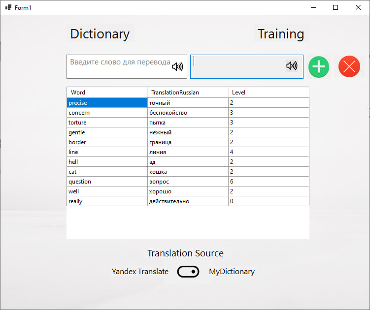
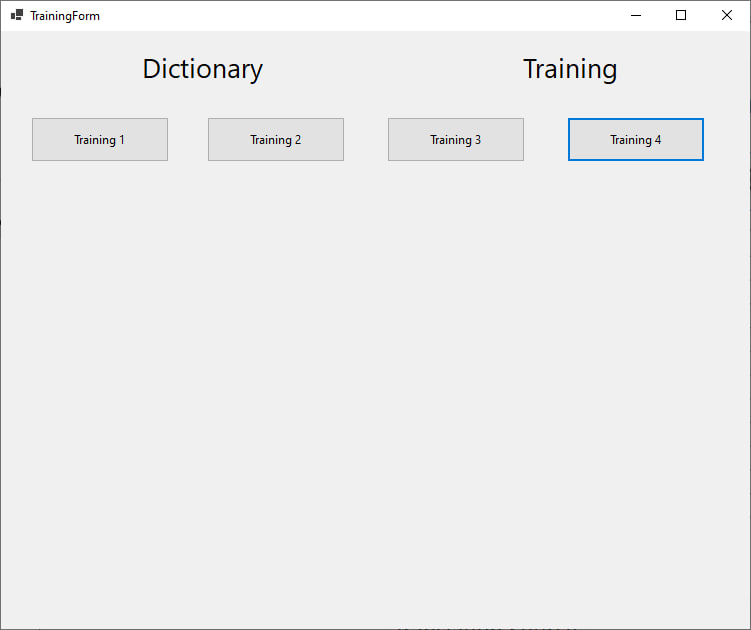
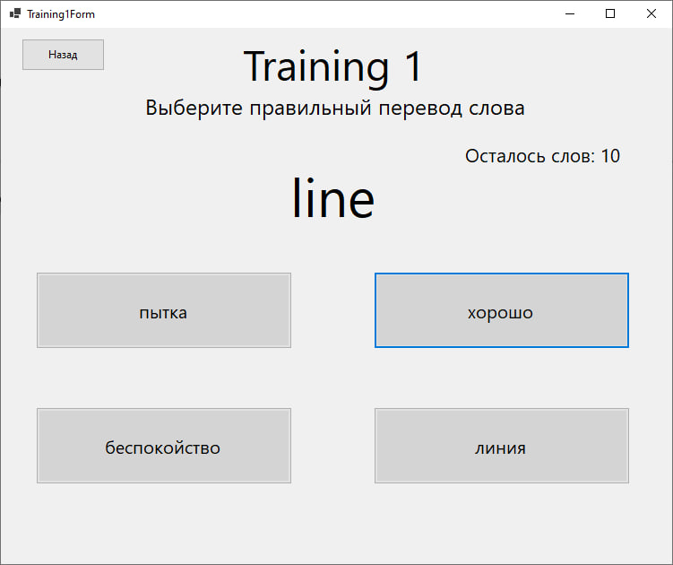
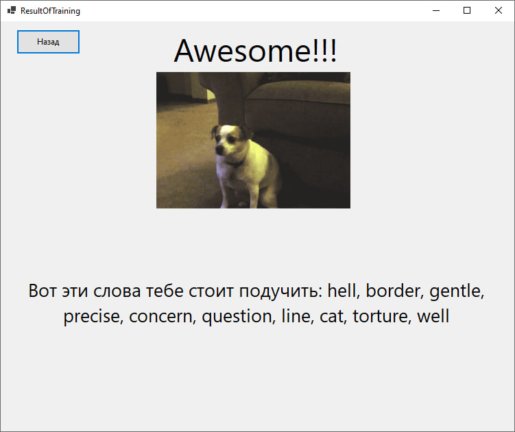

# EnglishApp
## Приложение для изучения английского языка

Написано оно на языке C# с использованием WindowsForms. Выбран именно это язык, потому что в нём есть необходимые для реализации средства языка.
Первое окно, которое видит пользователь – страница Dictionary. На этой странице отображается переводчик и словарь изучаемых слов.

Переводчик реализован двумя способами: первый способ – MyDictionary, второй способ – использование API Yandex Translate. 

В первом способе в базу данных  были загружены 10000 пар английское слово – его перевод на русский. Когда пользователь вводит первый символ, программа определяет код введённого символа и соответственно язык вводимого слова. Далее, с каждым нововведённым символом, программа проверяет есть ли такое слово в базе данных.

Во втором способе было использовано API Yandex Translate с помощью [ссылки](https://dictionary.yandex.net/api/v1/dicservice.json/lookup?key=dict.1.1.20221204T122255Z.e65d06242dd3e047.24dc4e761e7449f44e7535b828685da0ed33670c&lang=en-ru&text=Hello), где hello в конце – это слово, перевод которого нужно узнать.

Выбор текущего способа перевода можно выбрать внизу с помощью переключателя. 

Произношение написанного слова (если оно написано корректно) можно прослушать, нажав на соответствующую иконку в поле для ввода слова.

Справа от переводчика есть две кнопки – зелёная и красная. 

Зелёный плюсик означает добавление текущей пары слово – перевод в словарь учащегося. А при нажатии красный крест выделенная курсором пара будет удалена из словаря. Для реализации данных событий использовалась вторая таблица. При обработке нажатий этих кнопок вызываются соответствующие SQL команды.

Столбец Level в таблице словаря используется для отображения уровня изучения данного слова. 0 – слово только что добавлено, а 10 – слово полностью изучено. За прохождение тренировок балл будет добавляться или вычитаться в зависимости от правильно или неправильно угаданного слова соответственно. Баллы не могут выходить за пределы интервала 0 – 10.
При нажатии на надпись «Training» пользователь переходит на окно с тренировками. Пока что реализована только Training 1.

Тренировка заключается в правильном выборе перевода слова. При неправильном выборе этот вариант будет выделен красным, а правильный – зелёным. Десять слов для тренировки выбираются приоритетно наименее изученные, а каждое из них – случайным образом. Когда был выбран какой-либо вариант ответа программа имеет задержку в одну секунду, чтобы пользователь успел увидеть ошибся ли он.

В конце тренировки будут внесены изменения в уровень слов. Чем менее слово изучено, тем чаще оно будет попадаться на тренировках. Помимо этого, приложение покажет в каких словах ты ошибся, и укажет на то, что их нужно изучить.

## ВАЖНО
Для работы приложения используется локальный сервер с помощью программы MAMP. Информация о сервере вбивается в код программы. 
